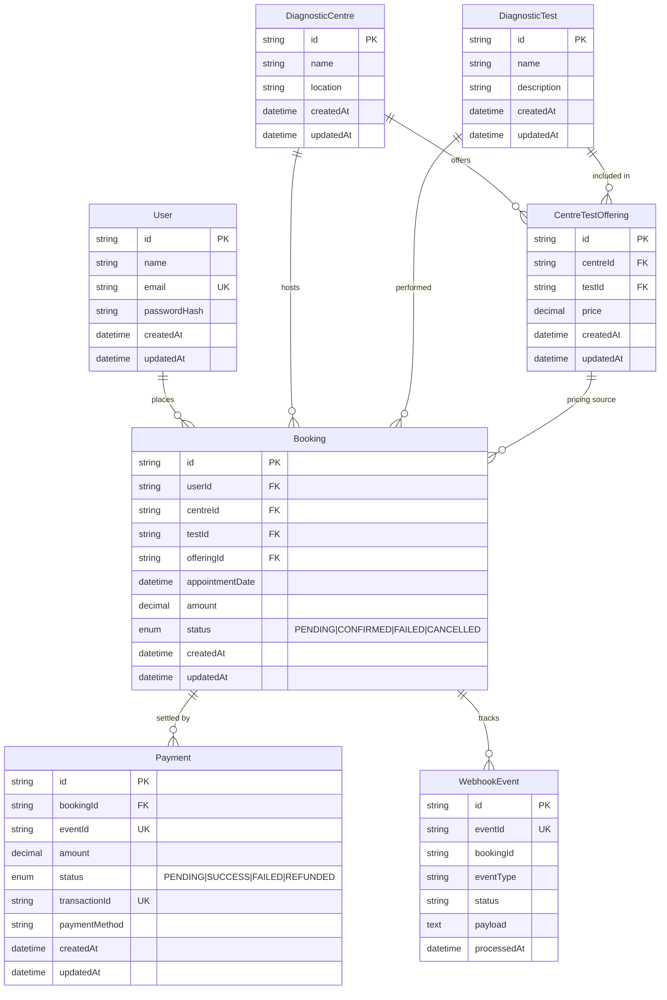
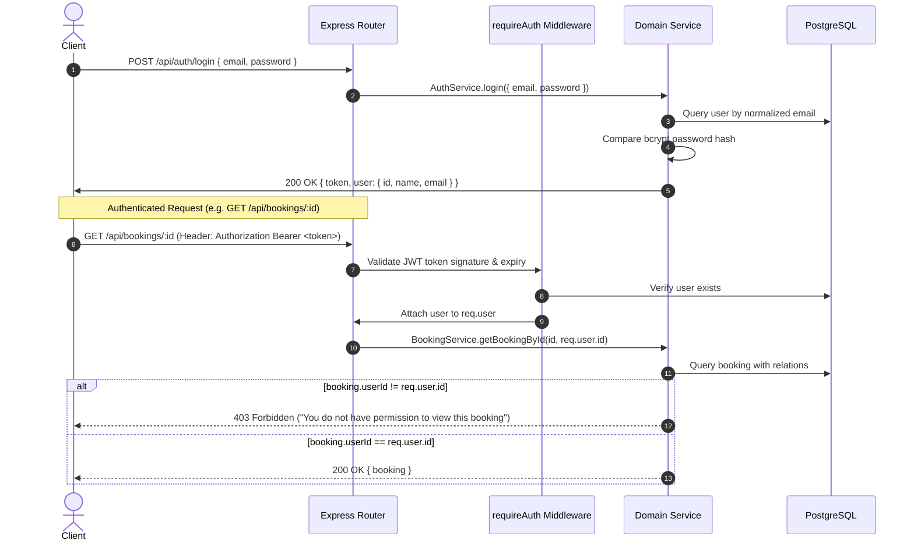
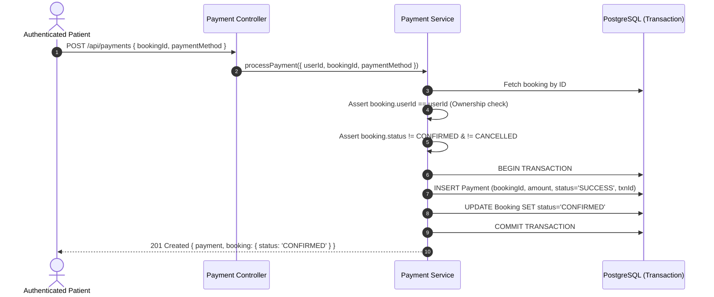
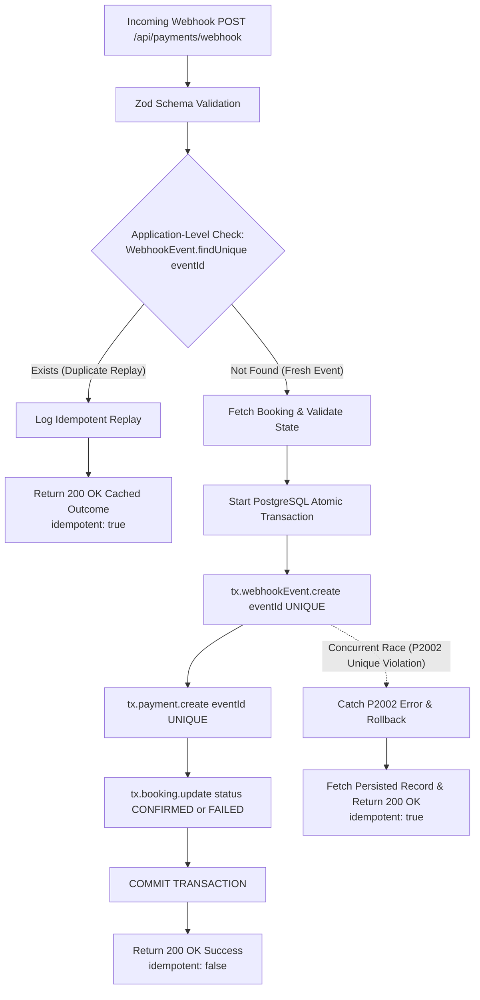

# EVE Healthcare — Diagnostic Test Booking Service

> Production-ready backend engineering service for diagnostic test discovery, offering management, appointment bookings, mock payments, and idempotent webhook processing at EVE Healthcare.

[](https://nodejs.org/)
[](https://expressjs.com/)
[](https://www.prisma.io/)
[](https://www.postgresql.org/)
[](http://localhost:5000/api-docs)
[-success.svg)](https://vitest.dev/)

---

## Table of Contents
1. [Project Overview](#1-project-overview)
2. [Problem Being Solved](#2-problem-being-solved)
3. [Tech Stack](#3-tech-stack)
4. [Layered Architecture](#4-layered-architecture)
5. [Database Design & Relational Schema](#5-database-design--relational-schema)
6. [Setup Instructions](#6-setup-instructions)
7. [Environment Variables](#7-environment-variables)
8. [Prisma Migrations & Database Seeding](#8-prisma-migrations--database-seeding)
9. [How to Run the Server](#9-how-to-run-the-server)
10. [How to Run Tests](#10-how-to-run-tests)
11. [Interactive API Documentation (Swagger)](#11-interactive-api-documentation-swagger)
12. [API Endpoint Specification & Examples](#12-api-endpoint-specification--examples)
13. [Authentication & Authorization Flow](#13-authentication--authorization-flow)
14. [Booking & Payment Flow](#14-booking--payment-flow)
15. [Webhook Processing & Idempotency Strategy](#15-webhook-processing--idempotency-strategy)
16. [Transaction & Concurrency Strategy](#16-transaction--concurrency-strategy)
17. [Booking State Machine Transitions](#17-booking-state-machine-transitions)
18. [Edge Case Handling Matrix](#18-edge-case-handling-matrix)
19. [Important Architectural Decisions & Assumptions](#19-important-architectural-decisions--assumptions)
20. [Current Implementation Status](#20-current-implementation-status)
21. [Future Improvements (Stage 3)](#21-future-improvements-stage-3)

---

## 1. Project Overview

The **EVE Healthcare Diagnostic Booking Service** is a modular RESTful backend platform engineered for patient diagnostic healthcare operations. The platform enables users to register, authenticate securely, discover diagnostic laboratories/centres across Bangalore, explore available pathology and radiology tests with dynamic centre-specific pricing, book appointment reservations, simulate mock payments, and ingest asynchronous payment webhooks with guaranteed single-execution idempotency.

This implementation represents **Stage 2 of 3** (Core Booking, Payments, Webhooks, Idempotency, and Authorization Hardening).

---

## 2. Problem Being Solved

- **Variable Lab Pricing:** Diagnostic tests vary in equipment grade, operational costs, and pricing across diagnostic centres.
- **Client Price Tampering:** Clients must never determine payment amounts. Amounts are calculated server-side from authoritative relational catalogue snapshots.
- **Payment & Booking Inconsistency:** A payment must never succeed without confirming the booking, nor should a booking be confirmed without a valid payment.
- **Webhook Duplication & Race Conditions:** Network retries from payment gateways (e.g. Razorpay, Stripe) frequently deliver duplicate webhook events simultaneously. The backend must guarantee single-execution semantics without duplicate payments or state corruption.
- **Data Privacy & Authorization:** Patient booking records are sensitive healthcare data requiring robust user-level isolation and ownership verification.

---

## 3. Tech Stack

| Layer / Concern | Technology | Purpose |
| :--- | :--- | :--- |
| **Runtime Environment** | Node.js (v20+ / v24+) | High-performance asynchronous event-driven JavaScript runtime (ES Modules) |
| **Web Framework** | Express.js 4.x | Fast, unopinionated minimalist web framework for routing and middleware |
| **Database** | PostgreSQL | Enterprise relational SQL database ensuring ACID compliance and relational integrity |
| **ORM & Migrations** | Prisma ORM 6.x | Type-safe schema modelling, query generation, migrations, and database seeding |
| **API Documentation** | Swagger / OpenAPI 3.0 | Interactive API documentation via `swagger-ui-express` & `swagger-jsdoc` |
| **Authentication & Security** | JWT (`jsonwebtoken`) & `bcryptjs` | Stateless Bearer token authentication and salted password hashing (10 rounds) |
| **Input Validation** | Zod 3.x | Schema-driven runtime request body, query, and parameter validation |
| **Configuration** | `dotenv` & Zod validation | Strict startup environment variable validation |
| **Testing Engine** | Vitest & Supertest | Automated integration testing suite for HTTP endpoints and database transactions |

---

## 4. Layered Architecture

The project adheres to a clean layered architecture with clear separation of concerns:

```
src/
├── app.js                   # Express application setup, global middleware, Swagger, 404 & error handlers
├── server.js                # Server entrypoint with DB connection checks & graceful shutdown
├── config/
│   ├── env.js               # Strict environment variable validation with Zod
│   ├── prisma.js            # Prisma Client singleton
│   └── swagger.js           # OpenAPI 3.0 / Swagger JSDoc specification
├── controllers/             # Thin HTTP controllers (parse request, call services, format response)
│   ├── auth.controller.js
│   ├── centre.controller.js
│   ├── test.controller.js
│   ├── booking.controller.js
│   └── payment.controller.js
├── services/                # Authoritative business logic, state machines & transactions
│   ├── auth.service.js
│   ├── centre.service.js
│   ├── test.service.js
│   ├── booking.service.js
│   └── payment.service.js
├── middleware/              # Reusable middleware
│   ├── auth.middleware.js   # JWT token extraction, decoding & user verification
│   ├── error.middleware.js  # Centralized error handler & 404 handler
│   ├── logger.middleware.js # Structured request logger (excluding sensitive credentials)
│   └── validate.middleware.js # Zod validation middleware for body, query, and params
├── routes/                  # Express route definitions
│   ├── auth.routes.js
│   ├── centre.routes.js
│   ├── test.routes.js
│   ├── booking.routes.js
│   ├── payment.routes.js
│   └── index.js             # Consolidated root API router (`/api`)
├── validators/              # Zod input schemas
│   ├── auth.validator.js
│   ├── centre.validator.js
│   ├── test.validator.js
│   ├── booking.validator.js
│   ├── payment.validator.js
│   └── common.validator.js
└── utils/                   # Shared utilities and helpers
    ├── constants.js         # HTTP status codes, BookingStatus/PaymentStatus enums, Error codes
    ├── errors.js            # Structured AppError class hierarchy
    └── response.js          # Standardized API response formatters
```

---

## 5. Database Design & Relational Schema

The relational schema is defined in [`prisma/schema.prisma`](prisma/schema.prisma).



---

## 6. Setup Instructions

### Prerequisites
- **Node.js**: v20.0.0 or higher
- **PostgreSQL**: PostgreSQL 14+ instance running locally or via Docker / embedded server

### 1. Clone & Install Dependencies
```bash
git clone <repository_url>
cd EveHealthcare
npm install
```

### 2. Configure Environment Variables
Copy the example environment file and configure your credentials:
```bash
cp .env.example .env
```

---

## 7. Environment Variables

| Variable | Type | Default | Description |
| :--- | :--- | :--- | :--- |
| `PORT` | Number | `5000` | HTTP port on which the Express server listens |
| `NODE_ENV` | String | `development` | Application environment (`development`, `test`, `production`) |
| `DATABASE_URL` | String | *Required* | PostgreSQL connection string |
| `JWT_SECRET` | String | *Required (min 8 chars)* | Secret key used for signing and verifying JWT tokens |
| `JWT_EXPIRES_IN` | String | `24h` | Expiration window for issued JWT tokens |

---

## 8. Prisma Migrations & Database Seeding

Generate the Prisma Client:
```bash
npm run prisma:generate
```

Apply database migrations / synchronize schema:
```bash
npm run prisma:migrate
```

Seed the database with realistic healthcare sample data:
```bash
npm run prisma:seed
```

### Seed Data Overview:
- **3 Registered Test Users:**
  - `alice@evehealthcare.com` (Password: `Password123`)
  - `bob@evehealthcare.com` (Password: `Password123`)
  - `charlie@evehealthcare.com` (Password: `Password123`)
- **4 Diagnostic Centres in Bangalore:**
  - `EVE Diagnostic & Imaging Centre - Indiranagar`
  - `EVE Multi-Speciality Pathology - Koramangala`
  - `EVE Advanced Diagnostics - Whitefield`
  - `EVE Diagnostics Hub - Jayanagar`
- **7 Diagnostic Tests:**
  - Complete Blood Count (CBC)
  - Lipid Profile / Cholesterol Panel
  - HbA1c (Glycated Hemoglobin)
  - Thyroid Profile (Total T3, Total T4, TSH)
  - Vitamin D (25-Hydroxy)
  - Liver Function Test (LFT)
  - Kidney Function Test (KFT / RFT)
- **23 Centre-Test Offerings** with realistic pricing differences across centres.
- **1 Initial Sample Booking** linked to User Alice.

---

## 9. How to Run the Server

```bash
npm run dev
# or: npm start
```

Output:
```
✅ Database connected successfully
🚀 EVE Healthcare Backend running in [development] mode on port 5000
🩺 Health check available at: http://localhost:5000/health
📖 Swagger Documentation available at: http://localhost:5000/api-docs
🌐 Base API available at: http://localhost:5000/api
```

---

## 10. How to Run Tests

Run the complete test suite:
```bash
npm test
```

Watch mode during active development:
```bash
npm run test:watch
```

### Test Suite Summary (48 Passing Integration Tests):
- `tests/health.test.js`: Health endpoint & global 404 handler
- `tests/docs.test.js`: OpenAPI JSON spec & Swagger UI HTML route
- `tests/auth.test.js`: Signup, duplicate rejection, login, hash verification, error cases
- `tests/centres.test.js`: Centres catalogue, test pricing aggregation, 404s
- `tests/tests.test.js`: Tests catalogue, centre availability aggregation, 404s
- `tests/bookings.test.js`: Protected routes, creation, price integrity, ownership checks, filters
- `tests/cancellation.test.js`: Booking cancellation (`PATCH /:id/cancel`), ownership checks, past date prevention
- `tests/payments.test.js`: Mock payments (`POST /api/payments`), atomic transaction state updates, already-paid checks
- `tests/webhooks.test.js`: Asynchronous webhooks (`POST /api/payments/webhook`), sequential duplicate idempotency, **simultaneous concurrent race conditions via `Promise.all`**, state conflict protections

---

## 11. Interactive API Documentation (Swagger)

Interactive Swagger UI documentation is available out of the box:
- **Interactive UI:** [http://localhost:5000/api-docs](http://localhost:5000/api-docs)
- **Raw OpenAPI 3.0 JSON Spec:** [http://localhost:5000/api-docs.json](http://localhost:5000/api-docs.json)

To test authenticated endpoints in Swagger UI:
1. Call `POST /api/auth/login` to obtain your JWT token.
2. Click the **Authorize** button (top right of Swagger UI).
3. Enter your token into the `BearerAuth` input field and click **Authorize**.

---

## 12. API Endpoint Specification & Examples

### Endpoints Overview

| Method | Path | Auth | Description |
| :--- | :--- | :---: | :--- |
| `GET` | `/health` | No | Server operational health & metadata |
| `GET` | `/api-docs` | No | Interactive Swagger UI API documentation |
| `POST` | `/api/auth/signup` | No | Register new patient account |
| `POST` | `/api/auth/login` | No | Authenticate credentials and receive JWT |
| `GET` | `/api/centres` | No | List diagnostic centres (`?search=`, `?location=`, `?testId=`) |
| `GET` | `/api/centres/:id` | No | Retrieve centre details with test pricing |
| `GET` | `/api/tests` | No | List diagnostic tests (`?search=`, `?centreId=`) |
| `GET` | `/api/tests/:id` | No | Retrieve test details and centres offering it |
| `POST` | `/api/bookings` | **Yes** | Create appointment booking (starts `PENDING`) |
| `GET` | `/api/bookings` | **Yes** | List authenticated user's bookings |
| `GET` | `/api/bookings/:id` | **Yes** | Retrieve single booking (ownership enforced) |
| `PATCH`| `/api/bookings/:id/cancel` | **Yes** | Cancel booking (ownership enforced) |
| `POST` | `/api/payments` *(or `/payments`)* | **Yes** | Process direct mock payment for booking |
| `POST` | `/api/payments/webhook` *(or `/payments/webhook`)* | No | Ingest payment provider webhook event |

### Key cURL Examples

#### 1. Authenticate (Login)
```bash
curl -X POST http://localhost:5000/api/auth/login \
  -H "Content-Type: application/json" \
  -d '{"email": "alice@evehealthcare.com", "password": "Password123"}'
```

#### 2. Create Booking
```bash
curl -X POST http://localhost:5000/api/bookings \
  -H "Content-Type: application/json" \
  -H "Authorization: Bearer <YOUR_JWT_TOKEN>" \
  -d '{
    "centreId": "<CENTRE_ID>",
    "testId": "<TEST_ID>",
    "appointmentDate": "2026-11-20T10:00:00.000Z"
  }'
```

#### 3. Process Mock Payment
```bash
curl -X POST http://localhost:5000/api/payments \
  -H "Content-Type: application/json" \
  -H "Authorization: Bearer <YOUR_JWT_TOKEN>" \
  -d '{
    "bookingId": "<BOOKING_ID>",
    "paymentMethod": "UPI"
  }'
```

#### 4. Send Payment Webhook
```bash
curl -X POST http://localhost:5000/api/payments/webhook \
  -H "Content-Type: application/json" \
  -d '{
    "eventId": "evt_gateway_99281a",
    "bookingId": "<BOOKING_ID>",
    "status": "SUCCESS",
    "paymentMethod": "RAZORPAY_MOCK"
  }'
```

---

## 13. Authentication & Authorization Flow



---

## 14. Booking & Payment Flow



---

## 15. Webhook Processing & Idempotency Strategy

### Why is Webhook Idempotency Necessary?
In production payment architectures:
1. **Network Retries & At-Least-Once Delivery:** Payment gateways (e.g., Stripe, Razorpay) employ exponential retry mechanisms when HTTP acknowledgments (200 OK) are delayed by network jitter.
2. **Distributed Replays:** Redundant webhooks can be triggered across multiple edge servers simultaneously.
3. **Double Confirmation Risks:** Without idempotency, multiple payment records would be created for the same booking, corrupting audit trails, balance sheets, and inventory allocations.

### How Does the Implementation Prevent Duplicate Processing?

Our implementation employs a **two-tier defense-in-depth strategy**:



1. **Application-Level Pre-Flight Check:** Fast lookup on the `WebhookEvent` table by `eventId`. If already present, immediately returns `200 OK` with `{ idempotent: true }` without executing database writes.
2. **Database-Level Unique Constraints:** The `WebhookEvent.eventId` and `Payment.eventId` columns have hard SQL `UNIQUE` constraints in PostgreSQL.
3. **Concurrent Race Condition Resolution:** If two identical webhook requests arrive in the exact same millisecond, both pass the pre-flight check. However, PostgreSQL's unique constraint forces one transaction to commit while the second fails with a `P2002` constraint violation. The service catches this exception and seamlessly returns the idempotent `200 OK` response.

---

## 16. Transaction & Concurrency Strategy

- **Atomicity via `prisma.$transaction`:** Creating the `Payment` record, logging the `WebhookEvent` audit trail, and updating the `Booking` status occur within a single ACID transaction.
- **Zero Inconsistent States:** It is architecturally impossible for a payment to be marked `SUCCESS` while the booking remains `PENDING`, or vice versa. If any query fails, the entire transaction is rolled back.
- **Historical Price Snapshot:** The payment amount is read directly from `Booking.amount` (which was snapshotted from `CentreTestOffering.price` at booking creation), guaranteeing financial consistency.

---

## 17. Booking State Machine Transitions

| From Status | Event / Action | Target Status | Allowed? | Notes |
| :--- | :--- | :--- | :---: | :--- |
| `PENDING` | Payment `SUCCESS` (Direct / Webhook) | `CONFIRMED` | ✅ Yes | Booking confirmed and locked |
| `PENDING` | Payment `FAILED` (Direct / Webhook) | `FAILED` | ✅ Yes | Marked failed; user may retry |
| `PENDING` | User Cancel (`PATCH /:id/cancel`) | `CANCELLED` | ✅ Yes | Booking cancelled |
| `CONFIRMED` | Duplicate Payment `SUCCESS` (same `eventId`) | `CONFIRMED` | ✅ Yes | Handled idempotently (no-op) |
| `CONFIRMED` | Conflicting Payment `FAILED` (late event) | `CONFIRMED` | ❌ Rejected | 409 Conflict: Cannot corrupt confirmed booking |
| `CONFIRMED` | Direct Payment Attempt | `CONFIRMED` | ❌ Rejected | 409 Conflict: Already confirmed & paid |
| `CONFIRMED` | User Cancel (`PATCH /:id/cancel`) | `CANCELLED` | ✅ Yes | Allowed prior to appointment datetime |
| `CANCELLED` | Any Payment / Webhook Attempt | `CANCELLED` | ❌ Rejected | 400 Bad Request: Cannot pay cancelled booking |
| `FAILED` | User Cancel Attempt | `FAILED` | ❌ Rejected | 400 Bad Request: Cannot cancel failed booking |

---

## 18. Edge Case Handling Matrix

| Scenario | Handled By | HTTP Status | Response Error Code / Payload |
| :--- | :--- | :---: | :--- |
| Missing / invalid JWT token | `requireAuth` middleware | `401` | `AUTHENTICATION_ERROR` |
| Patient viewing another patient's booking | `BookingService` ownership check | `403` | `AUTHORIZATION_ERROR` |
| Patient paying for another patient's booking | `PaymentService` ownership check | `403` | `AUTHORIZATION_ERROR` |
| Patient cancelling another patient's booking | `BookingService` ownership check | `403` | `AUTHORIZATION_ERROR` |
| Non-existent booking ID | Services lookup | `404` | `NOT_FOUND` |
| Non-existent centre or test ID | `BookingService` lookup | `404` | `NOT_FOUND` |
| Selected test not offered at centre | `BookingService` lookup | `400` | `BAD_REQUEST` |
| Past appointment datetime | `createBookingSchema` (Zod) | `400` | `VALIDATION_ERROR` |
| Duplicate user email on signup | `AuthService` + Prisma P2002 | `409` | `CONFLICT` |
| Invalid login credentials | `AuthService` (generic msg) | `401` | `AUTHENTICATION_ERROR` |
| Payment on already confirmed booking | `PaymentService` state check | `409` | `CONFLICT` |
| Payment on cancelled booking | `PaymentService` state check | `400` | `BAD_REQUEST` |
| Cancelling an already cancelled booking | `BookingService` state check | `400` | `BAD_REQUEST` |
| Cancelling past appointment | `BookingService` date check | `400` | `BAD_REQUEST` |
| Malformed webhook JSON payload | `webhookSchema` (Zod) | `400` | `VALIDATION_ERROR` |
| Duplicate sequential webhook | `WebhookEvent` lookup | `200` | `{ "data": { "idempotent": true } }` |
| Simultaneous concurrent duplicate webhooks | PostgreSQL `UNIQUE` + transaction | `200` | `{ "data": { "idempotent": true } }` |
| Late `FAILED` webhook on `CONFIRMED` booking | `PaymentService` state transition rule | `409` | `CONFLICT` |

---

## 19. Important Architectural Decisions & Assumptions

1. **Dedicated Webhook Audit Trail (`WebhookEvent`):** Persisting every unique incoming webhook event enables complete auditing and transparent idempotency replay verification.
2. **Support for Route Aliases:** Both `/api/payments/*` and root `/payments/*` routes are fully functional to support varied payment gateway callback routing conventions.
3. **Structured Request Logging:** The logging middleware outputs timestamp, method, path, status code, and latency, adding webhook-specific metadata without logging passwords or JWT secrets.
4. **Booking Cancellation Policy:** Patients may cancel `PENDING` or `CONFIRMED` bookings as long as the scheduled appointment datetime has not already passed.
5. **No Frontend & No External Payment SDKs:** The payment service is simulated with zero external dependencies (no Razorpay, Stripe, or MongoDB).

---

## 20. Current Implementation Status (Stage 2 Completed)

- [x] Express application setup with CORS, JSON parsing, 404 handler, and centralized error handling.
- [x] Strict environment validation via Zod (`src/config/env.js`).
- [x] PostgreSQL relational schema with Prisma ORM (`User`, `DiagnosticCentre`, `DiagnosticTest`, `CentreTestOffering`, `Booking`, `Payment`, `WebhookEvent`).
- [x] Database migrations and rich seeding script with realistic diagnostic centres and varied pricing.
- [x] Authentication system (`signup`, `login`, bcrypt hashing, JWT issuance, `requireAuth` middleware).
- [x] Diagnostic centres catalogue endpoints (`GET /api/centres`, `GET /api/centres/:id`).
- [x] Diagnostic tests catalogue endpoints (`GET /api/tests`, `GET /api/tests/:id`).
- [x] Core booking creation and retrieval with server-side price computation (`POST /api/bookings`, `GET /api/bookings`, `GET /api/bookings/:id`).
- [x] Booking cancellation endpoint with ownership and state protection (`PATCH /api/bookings/:id/cancel`).
- [x] Direct mock payment endpoint with atomic state transitions (`POST /api/payments` & `/payments`).
- [x] Payment webhook receiver with guaranteed idempotency and race condition handling (`POST /api/payments/webhook` & `/payments/webhook`).
- [x] Interactive Swagger / OpenAPI 3.0 documentation (`GET /api-docs` & `GET /api-docs.json`).
- [x] Structured request and audit logger middleware (`src/middleware/logger.middleware.js`).
- [x] **48 automated integration tests** covering all routes, validations, idempotency replays, concurrent race conditions, and authorization boundaries.

---

## 21. Future Improvements (Stage 3)

- Automated refund processing workflows upon cancelling a `CONFIRMED` paid booking.
- Advanced pagination metadata (`nextPage`, `prevPage`, `totalPages`) and test search indexing.
- Health analytics, automated booking reminder notifications, and laboratory technician assignment workflows.

---

## License
MIT License. Developed for EVE Healthcare Engineering.
