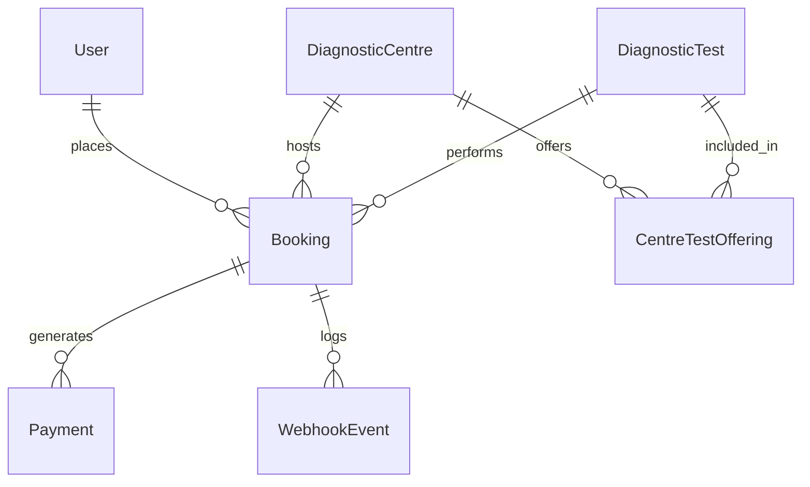

# 🩺 EVE Healthcare API

Production-ready backend service for diagnostic test discovery, appointment bookings, mock payments, and idempotent webhook callbacks.

Built with **Node.js (Express)**, **PostgreSQL**, and **Prisma ORM**.

---

## ⚡ Quick Start (Docker)

```bash
# Start PostgreSQL & API with auto-migrations and seeds
docker compose up --build
```

- 📚 **Swagger UI Docs:** [http://localhost:5000/api-docs](http://localhost:5000/api-docs)
- 🩺 **Health Check:** [http://localhost:5000/health](http://localhost:5000/health)
- 🌐 **Base API:** [http://localhost:5000/api](http://localhost:5000/api)

---

## 💻 Local Setup (Without Docker)

1. **Install dependencies:**
   ```bash
   npm install
   ```

2. **Configure environment:**
   ```bash
   cp .env.example .env
   ```

3. **Setup database & seed initial data:**
   ```bash
   npx prisma db push
   npm run prisma:seed
   ```

4. **Start the development server:**
   ```bash
   npm run dev
   ```

5. **Run tests:**
   ```bash
   npm test
   ```

---

## 📋 API Endpoints

| Module | Method | Endpoint | Auth | Description |
|---|---|---|:---:|---|
| **System** | `GET` | `/health` | No | Service status & uptime |
| **Auth** | `POST` | `/api/auth/signup` | No | Register new user account |
| | `POST` | `/api/auth/login` | No | Log in and receive JWT token |
| **Centres** | `GET` | `/api/centres` | No | List diagnostic centres & offerings |
| | `GET` | `/api/centres/:id` | No | Get centre details & test pricing |
| **Tests** | `GET` | `/api/tests` | No | List available diagnostic tests |
| | `GET` | `/api/tests/:id` | No | Get test details |
| **Bookings** | `POST` | `/api/bookings` | **Bearer** | Create a diagnostic appointment |
| | `GET` | `/api/bookings` | **Bearer** | List user's bookings |
| | `GET` | `/api/bookings/:id` | **Bearer** | Get booking by ID |
| | `PATCH` | `/api/bookings/:id/cancel` | **Bearer** | Cancel a booking |
| **Payments** | `POST` | `/api/payments` | **Bearer** | Process simulated payment |
| | `POST` | `/api/payments/webhook` | No | Idempotent webhook callback |

> 💡 Interactive API documentation with request/response schemas and authorization is available in the **[Swagger UI](http://localhost:5000/api-docs)**.

---

## 🗄️ Database Schema


